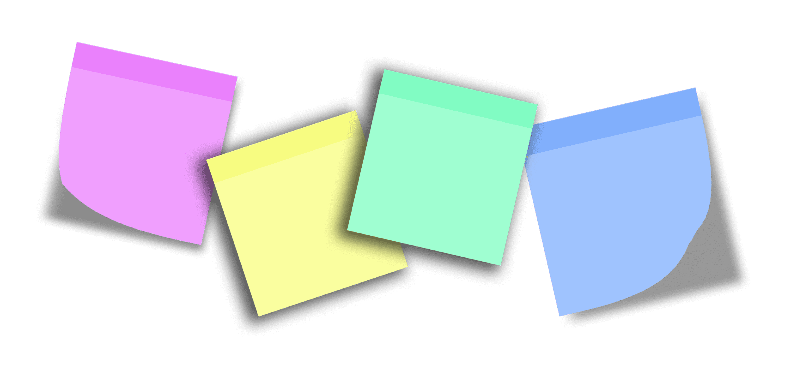

<h1> Librería de recursos web </h1>

<h4>La idea es colaborar entre nosotros y unir fuerzas.  En esta página puedes hallar los códigos de distintos proyecto, que facilitarán tu tarea.  
Entre ellos encontrarás ejemplos de layouts, buttons, menu responsives, efectos y muchas cosas más.<h4>
 

------------
<h3>Sección Librería</h3>
<h4>Aquí podrás ver un menú con los diferentes proyectos y sus ejemplos. También una botonera que te permitirá verlo y el código correspondiente: 
  

- VISTA
- HTML
- CSS
- JS
- OBJECT

 

<h3>Sección contribuciones</h3>
<h4>Siguiendo las instrucciones podrás aportar tu cuota de conocimiento a este proyecto. 
  

 
<h3>Sección webs de interés</h3>
<h4>En esta sección encontrarás una lista de páginas con diversas herramientas. 
  

 
<h3>Sección Quiénes Somos</h3>
<h4>Aquí encontrarás un breve comentario acerca de nosotros y nuestro objetivo. 
  

 
 

Maquetado del proyecto desde el archivo libreriaWeb.drawio y se puede ver en:
https://app.diagrams.net/

Herramientas que se utilizaron:  
  |  |  | 

| |  |  | 
| :------------: | :------------: | :------------: | :------------: | :------------: | :------------: | :------------: | 
| GIT | GITHUB  | Draw.io  |  AppNotas |  HTML  |  CSS  | JS | 
 
</h4>

 

 |  |  |
| :------------: | :------------: | :------------: |
| Lionel | Gladys | Luciana |
| 'Lyon' |  | 'LuMa' |
| Staricoff | Romero ||
 |  |  ||
 | <a href="https://magicode-webpersonal.netlify.app">WebPersonal</a> |  

